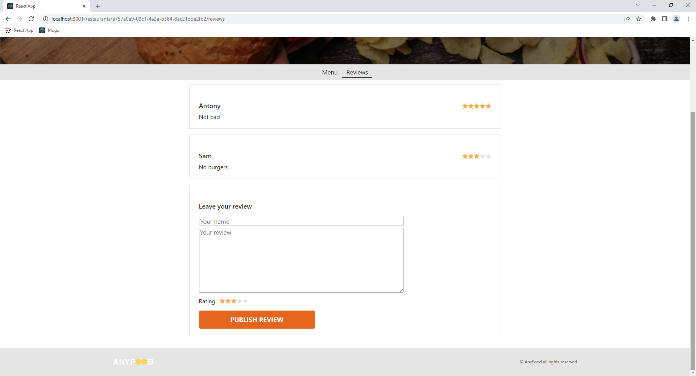

# AnyFood
## :uk: English
__Description:__ Web-application for food ordering

__Deployed project:__ http://anyfood.alexander-portfolio-and-cv.com

__Used technologies:__

- React
- Redux
- Redux thunk
- Immer
- Connected React Router
- Jest
- Enzyme
- Proptypes
- Reselect

__About project:__ AnyFood is application for online food ordering. You can order food from several restaurants and select currency that is convenient for you. Reviews and user rating can help you with choice. Application made via React/Redux stack. It also uses client Routing that make switching between pages almost immediate. Jest, Enzyme and Proptypes testing libraries also were used in development, that ensures high reliability and fault-tolerance.

Notice: It's an internship project completed as a part of React course from [learn.javascript.ru](learn.javascript.ru) website.

## :ru: Русский
__Описание:__ Веб-приложение для заказа еды

__Развернутый проект:__ http://anyfood.alexander-portfolio-and-cv.com

__Использованные технологии:__

- React
- Redux
- Redux thunk
- Immer
- Connected React Router
- Jest
- Enzyme
- Proptypes
- Reselect

 

__О проекте:__ AnyFood - это приложение для заказа еды онлайн. На сайте доступно несколько ресторанов, есть возможность выбрать удобную вам валюту, а наличие отзывов и пользовательского рейтинга помогут не ошибиться с выбором. Приложение разработано с использованием стека React/Redux. Так же в приложении используется клиентский роутинг что делает переключение между страницами практически мгновенным. Для тестирования на этапе разработки применялись библиотеки JEST, Enzyme и PropTypes, что обеспечивает высокую надежность приложения.

Примечание: Это учебный проект, написанный в рамках прохождения курса по React на сайте [learn.javascript.ru](learn.javascript.ru).

 

## Preview/Превью

